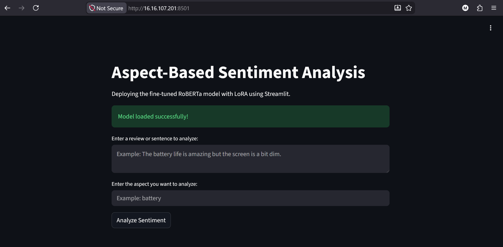
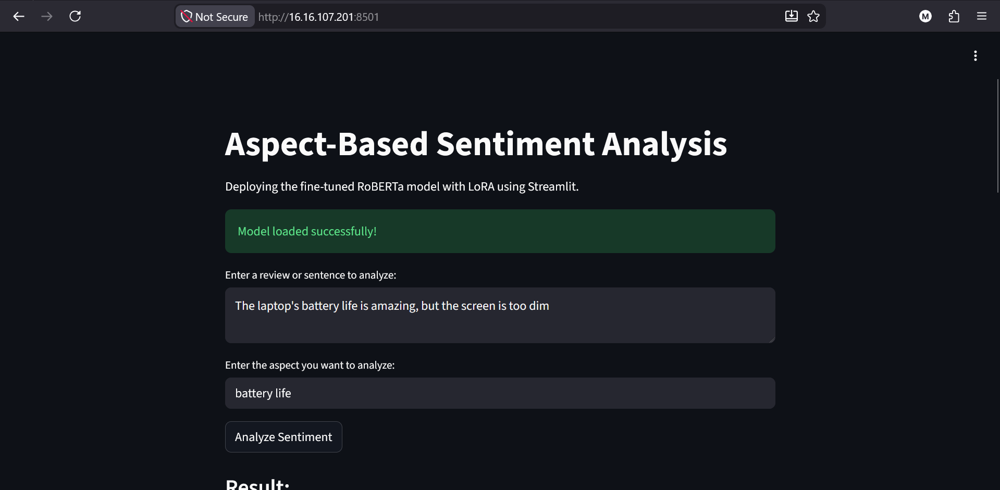
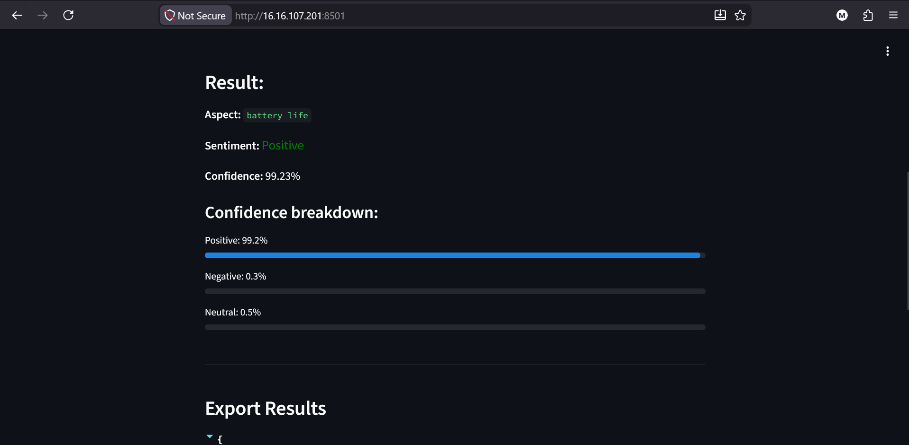
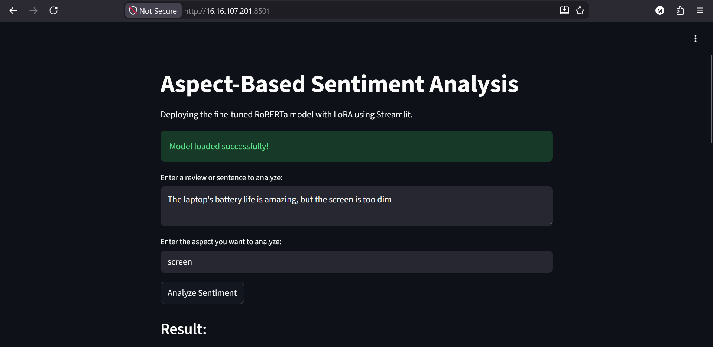
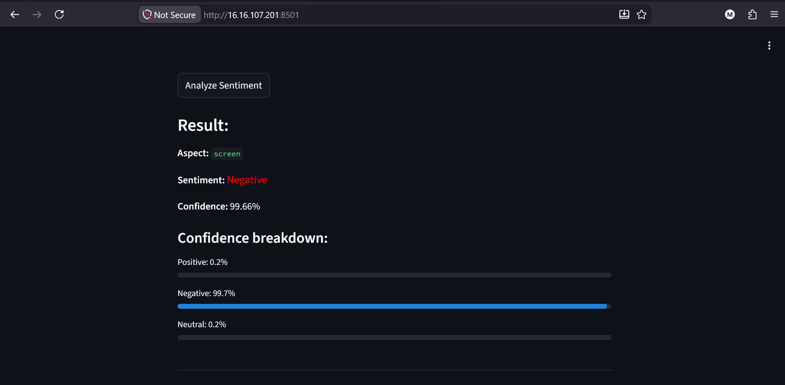

# Aspect-Based Sentiment Analysis

This project provides a web interface for performing **Aspect-Based Sentiment Analysis (ABSA)** using a fine-tuned **RoBERTa** model with **LoRA (Low-Rank Adaptation)**. The application is built using [Streamlit](https://streamlit.io/) and allows users to analyze the sentiment of specific aspects within a given text.

**🚀 Live Demo on AWS:** [http://16.16.107.201:8501/](http://16.16.107.201:8501/)

## Features

- **Aspect-Based Analysis:** Input a sentence and a specific aspect to determine the sentiment (Positive, Negative, or Neutral) directed towards that aspect.
- **Confidence Breakdown:** View detailed probability scores for each sentiment class.
- **Export Results:** Easily export the analysis results as a JSON file.
- **Efficient Inference:** Utilizes PEFT (Parameter-Efficient Fine-Tuning) with LoRA for efficient model loading and inference.

## Screenshots

### 1. Application Interface
The website interface before any input is provided.


### 2. Entering Input
Entering the sentence and the specific aspect to be analyzed.


### 3. Analysis Result
The sentiment prediction along with the confidence breakdown.


### 4. Changing Aspect
Changing the aspect for the same sentence to see how the sentiment changes.


### 5. New Analysis Result
The new sentiment prediction and confidence breakdown for the updated aspect.


## Installation

1. Clone the repository:
   ```bash
   git clone https://github.com/mohamed-tarek-01/Aspect-Based-Sentiment-Analysis.git
   cd Cloud-Project
   ```

2. Install the required dependencies:
   ```bash
   pip install -r requirements.txt
   ```

3. Ensure that the fine-tuned model and its configuration are placed in the `./final-absa-model` directory.

## Running the Application

To launch the Streamlit app, run the following command in your terminal:

```bash
streamlit run app.py
```

The application will open in your default web browser at `http://localhost:8501`.

## Project Structure

- `app.py`: The main Streamlit application script.
- `opinion-mining-roberta-lora.ipynb`: Jupyter Notebook containing the training and fine-tuning process using RoBERTa and LoRA.
- `final-absa-model/`: Directory containing the fine-tuned LoRA adapter and model configuration.
- `screenshots/`: Contains screenshots of the application.
